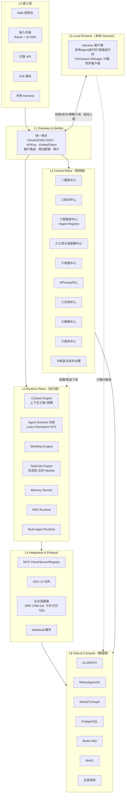
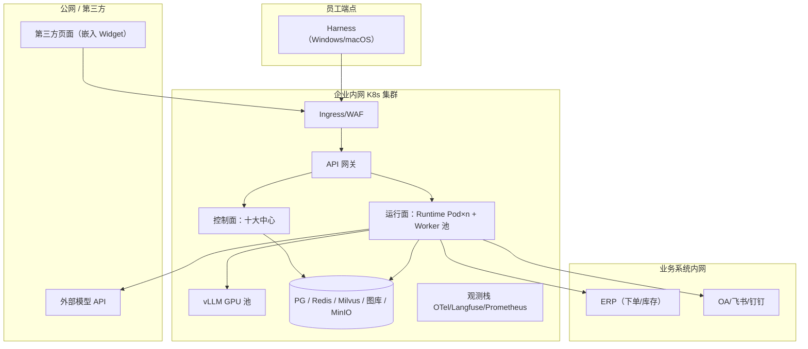

# 02 总体架构设计

> EAP 系列文档 02/09 ｜ 上篇：[01 需求与竞品](01-需求与竞品分析.md) ｜ 下篇：[03 Agent Runtime 与执行模型](03-AgentRuntime与执行模型.md)

---

## 1. 架构总原则

1. **三面分离**：Control Plane（管理面：有什么/怎么配/谁能用）、Runtime Plane（执行面：怎么跑）、Data Plane（数据面：真访问模型/数据/外部系统）。管理面禁止直接触达数据面资源，一切执行经运行面。
2. **一切皆制品（Artifact）**：Agent、技能、Prompt、工作流、模型、知识库全部版本化，走 Draft→Test→Review→Publish→Canary→Prod→Rollback 流水线。
3. **能力声明式（Declarative）**：Agent/技能/专用模型通过 Manifest（K8s 风格）声明依赖与权限，平台负责校验、注入与治理。
4. **协议优先**：内部能力一律以 MCP Server 形式暴露（工具/知识库/智能体），对外互联用 A2A 1.0，模型调用统一 OpenAI 兼容协议——任何一层可被独立替换。
5. **默认安全**：租户隔离、最小权限、工具级授权、沙箱执行、全链路审计是横切默认项，不是可选项。

## 2. 总体架构图

> 本文档所有 mermaid 图的独立源文件位于 [diagrams/](../diagrams/)，可在任何支持 mermaid 的工具中维护。

## 3. 三面职责边界

| 面 | 回答的问题 | 组成 | 失效影响 |
|---|---|---|---|
| Control Plane (L2) | 有什么、怎么配置、谁能用 | 十大中心 | 新发布不可用，**存量会话不受影响** |
| Runtime Plane (L3) | 怎么执行 | 七大执行引擎组件 | 对话/任务失败，**配置资产无损** |
| Data Plane (L6+L4+L5) | 真正访问模型/数据/外部系统 | 存储、推理、连接器、本地 Harness | 单点降级（路由/缓存/队列兜底） |

## 4. 分层职责（L0–L6）

| 层 | 名称 | 职责 | 关键点 |
|---|---|---|---|
| L0 | 接入层 | 五种入口统一收敛 | 嵌入外链走专用 EmbedToken；Harness 走设备授权 + 同步协议 |
| L1 | Gateway & Identity | 认证、租户识别、限流、审计、路由 | 三种凭证体系（用户 Token / Agent API Key / Embed Token）；全链路 TraceId 注入 |
| L2 | Control Plane | 十大中心（见 §5） | 只做管理与治理，不参与请求执行热路径 |
| L3 | Runtime Plane | 七大执行组件（见 §6） | 无状态引擎 + 外置状态（PG checkpoint / Redis 会话），可水平扩 |
| L4 | Integration & Protocol | MCP 三重身份、A2A 1.0、连接器、Webhook | Tool（能做什么）与 Connector（连到哪）分离 |
| L5 | Local Runtime | Harness 桌面端 | 沙箱四域策略（文件/网络/进程/浏览器）、技能签名校验、离线降级 |
| L6 | Data & Compute | 存储、推理、队列、业务系统 | 租户隔离到底层（RLS / collection / label / 前缀） |

## 5. Control Plane 十大中心

| # | 中心 | 核心职责 | 详细设计 |
|---|---|---|---|
| ① | 模型中心 | 供应商适配、能力抽象（chat/reasoning/embedding/rerank/vision/extraction/stt/tts/image_gen/moderation）、路由+Policy Engine、定制与专用模型注册、vLLM Deployment 管理 | 04 §3 |
| ② | 知识中心 | 多 KB 实例+模板（客服 FAQ 等）、Ingestion、三路索引（向量+稀疏+图谱）、KG 增量构建、数据生命周期、Citation | 04 §2 |
| ③ | 智能体中心 + Agent Registry | 内置工作流 Agent、SDK 注册 Agent、A2A 外部 Agent 三类统一纳管；目录、健康、灰度 | 03 §7 |
| ④ | 工具与连接器中心 | Tool（Agent 能做什么）/ Connector（连到哪个系统）分离；MCP Registry；企业连接器（下单/库存/CRM/OA/飞书/钉钉/SQL/REST） | 04 §5 |
| ⑤ | 技能中心 | SKILL.md 技能包、权限声明、签名、审核、市场分发（云端↔Harness） | 04 §4 |
| ⑥ | Prompt 中心 | 模板/变量/版本/A-B 实验/发布回滚，Prompt 是独立资产 | 05 §3 |
| ⑦ | 评测中心 | 数据集、LLM 裁判+规则裁判+人工、回归、发布门禁 | 08 §3 |
| ⑧ | 策略中心 | RBAC/ABAC、工具权限、数据分级、护栏（输入/输出审查） | 06 §2 |
| ⑨ | 成本中心 | Token/调用/GPU 计量、预算配额、按租户/Agent/模型账单 | 08 §4 |
| ⑩ | 制品与发布治理 | 统一版本流水线、环境体系（dev/test/staging/prod）、灰度回滚 | 06 §4 |

## 6. Runtime Plane 七大组件

| 组件 | 职责 | 关键机制 | 详细设计 |
|---|---|---|---|
| Context Engine | 按预算组装上下文 | 13 类上下文来源、Budget 分配、压缩 | 03 §2 |
| Agent Runtime 内核 | 执行循环与状态 | Context Manager + Execution Engine + State Manager 三件套；Checkpoint/Resume；HITL；超时/重试/取消；Token/执行预算 | 03 §1 |
| Workflow Engine | 简单 Agent（画布/DSL） | 确定性编排、并行分支、人审节点 | 03 §6 |
| Task/Job Engine | 长任务 | 8 态状态机、队列、Worker、优先级、调度 | 03 §5 |
| Memory Service | 记忆 | 会话短期记忆、用户/组织长期记忆、任务状态记忆 | 03 §4 |
| RAG Runtime | 检索执行 | 改写→路由→三路召回→融合→重排→压缩 | 04 §2.3 |
| Multi-Agent Runtime | 多智能体 | Supervisor / Handoff / 群聊协作 | 03 §6 |

## 7. 关键跨面交互

Control → Runtime：配置与制品经发布流水线**下发为不可变快照**（Agent 运行时引用版本号而非活配置），保证"线上与测试不一致"问题有据可查。

Runtime → Data：执行引擎对模型/向量库/图库/业务系统的访问一律走 L4 协议端点（MCP/OpenAI 兼容/连接器 SDK），由策略中心强制数据边界（如"财务知识库禁止路由到外部模型"）。

Local（L5）↔ Cloud：Harness 是**被治理的胖客户端**——云端订阅（智能体/知识库/技能包/策略）+ 沙箱内执行 + 遥测回报；插件市场是云端技能中心的分发渠道，安装必经权限提示与签名校验。

## 8. 领域模型概览

> 图源：[diagrams/14-domain-model.mmd](../diagrams/14-domain-model.mmd)（完整 ER 与表结构见 [05-领域模型与数据模型](05-领域模型与数据模型.md)）

核心对象链：`Tenant → User/Role → Agent(Version) →{Prompt 版本, Model 部署, Skill 版本, Tool, KB}`；`KB → Document → Chunk → {Vector, GraphEntity}`；`Task → Execution → Span → UsageRecord`。完整 ER 与表结构见 [05-领域模型与数据模型](05-领域模型与数据模型.md)。

## 9. 部署拓扑概览

> 完整拓扑图源：[diagrams/15-deployment-topology.mmd](../diagrams/15-deployment-topology.mmd)

混合部署：核心平台（K8s 集群：控制面+运行面+存储+vLLM GPU 池）内网私有化；模型网关按策略路由外部供应商 API；Harness 安装在员工 Windows 桌面，经网关同步。容量与 SLO 依据见 [08 §5](08-观测评测成本与SLO.md)。
