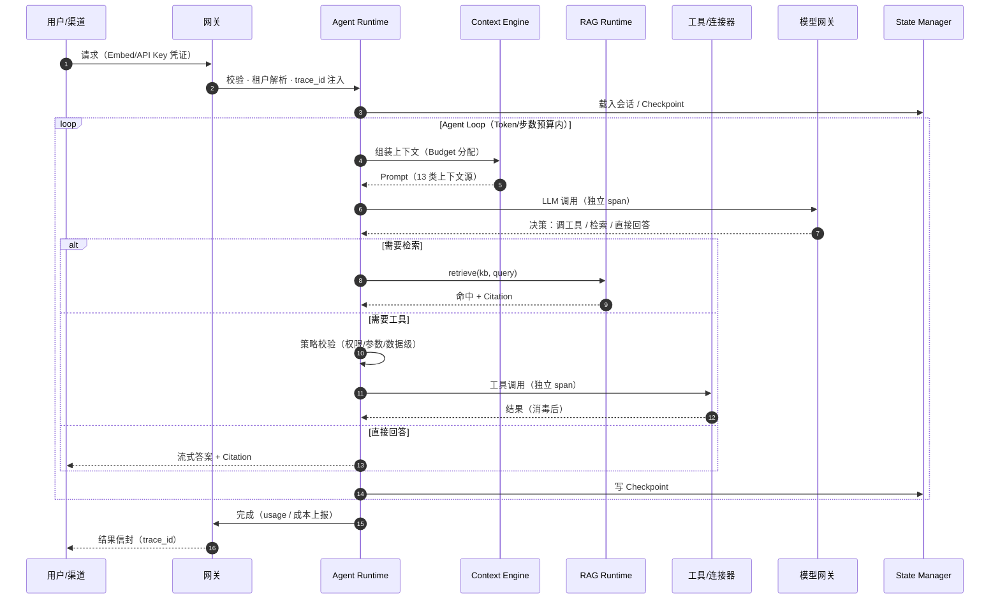
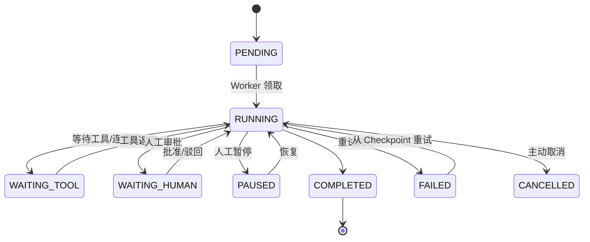
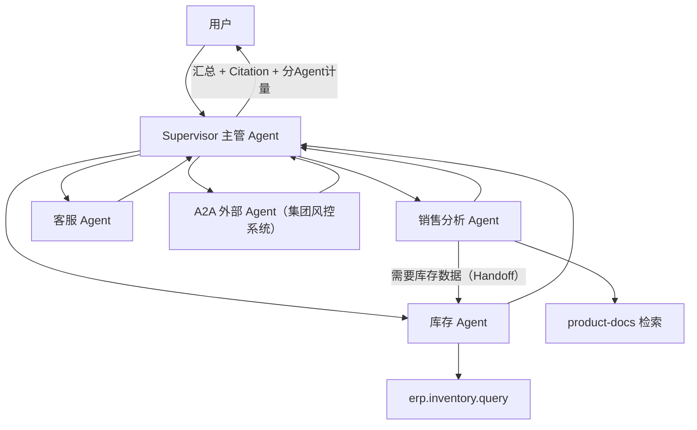
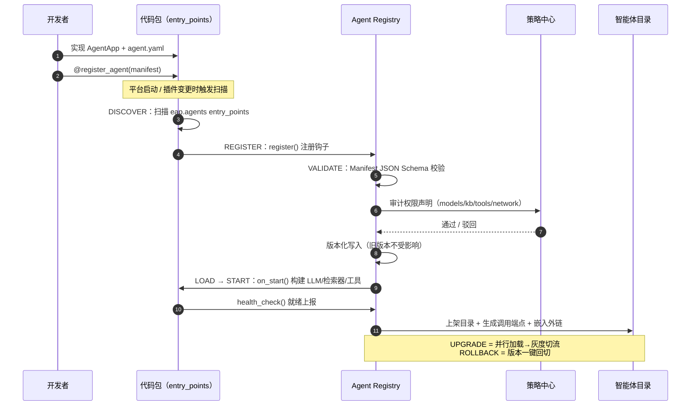

# 03 Agent Runtime 与执行模型

> EAP 系列文档 03/09 ｜ 上篇：[02 总体架构](02-总体架构设计.md) ｜ 下篇：[04 核心机制设计](04-核心机制设计.md)

---

## 1. Agent Runtime 内核（执行面的心脏）

**核心判断：LangGraph 是 Runtime 的实现组件，不是 Runtime 本身。** 内核自研为三件套，LangGraph 只承担"状态图执行器"这一角色，可被替换。

```
                 Agent Request
                      ↓
              ┌─ Context Manager ─┐   Prompt组装 · Memory · RAG · Skills · 预算
              ↓                   ↓
        Policy / Guardrail     Context Budget
              ↓
        ┌── Execution Engine ──┐
        │  Agent Loop:         │   Think → Tool Call → RAG → Skill → Handoff
        │  (LangGraph 执行器)   │   子Agent · 流式 · 超时/重试/取消 · 并发
        └──────────┬───────────┘
                   ↓
             State Manager          Checkpoint · Session · 长任务恢复 · HITL
```

### 1.1 三件套职责

| 组件 | 职责 | 关键机制 |
|---|---|---|
| **Context Manager** | 每一轮循环组装上下文 | 13 类上下文源（见 §2）、Context Budget、压缩摘要 |
| **Execution Engine** | 执行 Agent Loop | Tool Calling、Skill 调用、RAG 调用、Handoff、子 Agent、流式输出、超时/重试/取消、并发控制、Token Budget / 执行步数预算 |
| **State Manager** | 状态持久化 | Checkpoint（每步落库）、Resume（崩溃/续跑）、Session、HITL 挂起/恢复 |

### 1.2 Agent Loop 执行时序



> 图源：[diagrams/03-agent-execution-sequence.mmd](../diagrams/03-agent-execution-sequence.mmd)

要点：
- 每次 LLM 调用、工具调用、检索都产生**独立 Span**（traceId 贯穿），并记录 token 用量 → 成本中心；
- 工具调用前经**策略引擎检查**（工具权限 + 参数护栏 + 数据分级），不通过则拒绝并回注提示；
- 每步结束写 Checkpoint；进程崩溃后凭 `execution_id` 恢复；
- 达到预算上限（token/步数/时长）→ 优雅终止并输出已得结论 + 待办说明。

### 1.3 与 LangGraph 的边界

| 由 LangGraph 承担 | 由自研内核承担 |
|---|---|
| 图状态机执行、条件边、子图 | Context 组装与 Budget、策略/护栏挂钩、Checkpoint 存储（PG 后端）、HITL 挂起恢复、多租户调度、预算熔断、Trace 埋点、与 Task Engine 的队列衔接 |

## 2. Context Engineering（上下文工程）

**问题**：RAG + Skill + Memory + MCP + Agent 全塞进 Prompt = 灾难。**原则：上下文是预算内组装出来的，不是堆出来的。**

### 2.1 上下文组装清单（13 类来源）

| # | 来源 | 提供方 | 注入方式 |
|---|---|---|---|
| 1 | System Prompt 基座 | 平台 | 固定 |
| 2 | 租户/用户上下文 | 网关 | 身份、部门、语言、时区 |
| 3 | Agent Instructions | 智能体版本 | 人设、规则、输出格式 |
| 4 | Skill 指令 | 技能中心 | 渐进式披露（L1 名称→L2 正文→L3 资源） |
| 5 | Tool Schema | 工具中心 | 仅本轮可见工具的 JSON Schema |
| 6 | 检索文档 | RAG Runtime | 带引用标记 `[doc:chunk]` |
| 7 | 图谱上下文 | 知识中心 | 多跳子图线性化 |
| 8 | 会话记忆 | Memory | 滑窗 + 摘要 |
| 9 | 长期记忆 | Memory | 用户画像/偏好/事实卡 |
| 10 | 任务状态 | State Manager | 计划、已完成步骤、中间产物 |
| 11 | 历史工具结果 | Execution Engine | 近 N 步原始，更早压缩 |
| 12 | 护栏提示 | 策略中心 | 拒绝原因回注、安全提醒 |
| 13 | 预留余量 | — | 防截断、防"越拼越满" |

### 2.2 Context Budget（以 128K 模型为例）

```
System 基座          5K   │  Agent 指令      3K
Skills(L1/L2)        8K   │  Tool Schema    10K
Memory              15K   │  RAG            30K
Conversation        40K   │  Reserve        17K
```

超预算策略按优先级丢弃：历史工具结果压缩 → 会话摘要化 → RAG 重排截断 → 降级到更长上下文模型（策略中心允许时）。

## 3. Agent 的三种形态

| 形态 | 构建方式 | 执行者 | 典型场景 |
|---|---|---|---|
| **工作流 Agent（简单）** | 画布/DSL 编排，确定性路径 | Workflow Engine | 官网客服、工单分类、固定报表 |
| **注册 Agent（复杂）** | 手写代码（LangChain/LangGraph）+ 注册钩子 | Agent Runtime 内核 | 销售分析、采购多跳问答、跨系统操作 |
| **A2A 外部 Agent** | 他方实现，暴露 Agent Card | 对方运行时（平台经 A2A 调用） | 集团兄弟系统、合作伙伴智能体 |

三类在 Agent Registry 中统一纳管、统一目录、统一鉴权与计量。

## 4. Memory（记忆体系）

| 层 | 内容 | 存储 | 生命周期 |
|---|---|---|---|
| 会话记忆 | 对话历史（滑窗+摘要） | Redis（热）+ PG（冷） | 会话级，TTL 可配 |
| 长期记忆 | 用户画像、事实卡、偏好 | PG + 向量库（可检索） | 用户级，可管理/删除 |
| 任务记忆 | 计划、中间产物、工具结果 | PG（checkpoint 表）+ MinIO（大产物） | 任务级，随任务归档 |
| 组织记忆 | 团队共享知识卡 | 知识中心特殊 KB | 由知识中心生命周期管理 |

## 5. Task / Job 模型（长任务）

企业任务不是一次 Request/Response。例："分析本月全部销售订单 → 生成 Excel → 审批 → 发邮件给老板"，可能运行几十分钟并跨越人工环节。

### 5.1 任务状态机



> 状态变迁全部落 Checkpoint；FAILED/CANCELLED 可凭最近快照续跑，不重复已成功的工具调用。

### 5.2 异步执行架构

```
API Gateway → Agent Runtime
                 ├─ 同步路径：短会话直接流式返回
                 └─ 异步路径：Task 入队
                       ↓
                 Message Queue（MVP: Redis Streams；演进位: Kafka/NATS）
                       ↓
                 Worker 池（Agent Worker / RAG Worker / Tool Worker，可独立扩容）
```

Task Engine 提供：Task ID / Execution ID、优先级、定时调度（cron）、重试策略、超时熔断、取消传播、断点续跑（从最近 Checkpoint）。API 见 [07 §2](07-API-SDK-Protocol规范.md)。

## 6. Workflow Engine 与 Multi-Agent Runtime

**Workflow Engine（简单 Agent）**：节点类型 = LLM 节点 / 工具节点 / 知识检索节点 / 条件分支 / 并行 / 循环 / 人工审批 / 子流程；DSL 版本化，走制品发布流水线；执行确定性可重放。

**Multi-Agent Runtime（复杂协作）**：



> 图源：[diagrams/08-multi-agent-handoff.mmd](../diagrams/08-multi-agent-handoff.mmd)

- **Supervisor 模式**：主管 Agent 分派给专家 Agent（销售分析/库存/客服），汇总结果；
- **Handoff 模式**：Agent 间显式移交（含上下文快照与任务说明），A2A 场景跨系统移交同样适用；
- 协作链路全程同 Trace、分 Agent 计量计费。

## 7. 注册钩子与 Agent 生命周期（手写智能体接入，R7）

### 7.1 完整生命周期

```
INSTALL → DISCOVER → VALIDATE → REGISTER → LOAD → START ⇄ HEALTHY
                                                     ↓
              UNLOAD ← STOP ← （运行中）
              UPGRADE（新版本并行加载→流量灰度→切流）
              ROLLBACK（一键回退上一版本）
```

SDK 提供对应钩子：

```python
class AgentApp:
    async def on_install(self): ...      # 首次安装：建表/初始化资源
    async def on_register(self): ...     # 注册后回调：声明生效确认
    async def on_start(self): ...        # 构建运行时对象（LLM/检索器/工具）
    async def health_check(self) -> Health: ...   # 就绪探针
    async def on_stop(self): ...         # 优雅停止：排空在途请求
    async def on_uninstall(self): ...    # 清理（保留数据由租户决定）
```

### 7.2 自动发现与注册时序



> 图源：[diagrams/04-agent-registration-sequence.mmd](../diagrams/04-agent-registration-sequence.mmd)

平台启动/插件变更时扫描 Python entry points（group=`eap.agents`）与插件目录 → import 模块 → 模块在加载期调用 `registry.register()` 钩子 → 平台按 JSON Schema 校验 Manifest → 策略中心审计权限声明 → 版本化写入 Agent Registry → 健康检查通过后上架目录，自动生成统一调用端点与嵌入外链。

### 7.3 Agent Manifest（能力声明，K8s 风格）

```yaml
apiVersion: agent.eap.io/v1
kind: AgentApp
metadata:
  name: sales-analysis          # 全局唯一
  version: 1.4.0
  description: 销售数据分析与下单助手
  publisher: sales-team
spec:
  runtime: { python: ">=3.11", sdk: ">=0.8" }
  entry: sales_analysis.agent:SalesAgent
  models:                        # 按能力声明，不写死模型名
    - { capability: reasoning, required: true }
    - { capability: vision, required: false }
  knowledge: [product-docs, sales-playbook]
  tools: [erp.order.create, erp.inventory.query]
  skills: [sales-analysis, excel-report]
  permissions: [order.read, order.create]
  resources: { cpu: "1", memory: 1Gi }
  network:
    allow: [erp.internal]
  endpoints: { invoke: auto, stream: auto, health: auto }
  embeddable: { enabled: true, domains: ["sales.company.cn"] }
```

Manifest 全字段说明与 JSON Schema 见 [07 §4](07-API-SDK-Protocol规范.md)。**Agent 至此成为平台可治理的计算单元**：声明即权限边界，版本即灰度单位。

## 8. 长任务示例（端到端）

"分析本月订单并生成报表发邮件"：`Task(PENDING)` 入队 → Agent Worker 领取（RUNNING）→ 连接器拉取 1 万条订单（WAITING_TOOL→分页流式）→ 长期分析（每 5 分钟 Checkpoint）→ 生成 Excel 存 MinIO → HITL 审批（WAITING_HUMAN，管理员在控制台批准）→ 连接器发送邮件 → COMPLETED。全程单 Trace，成本按 Agent/模型分摊。
