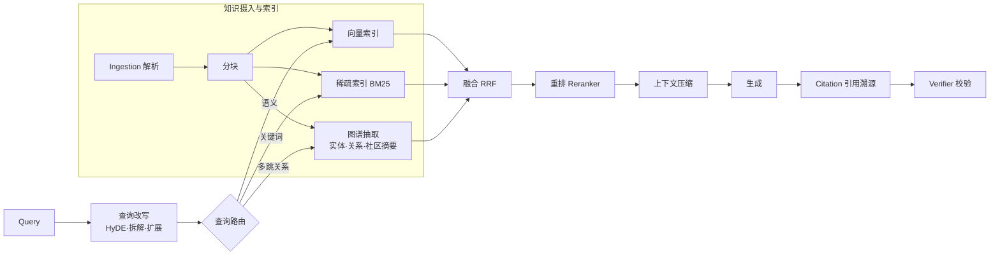
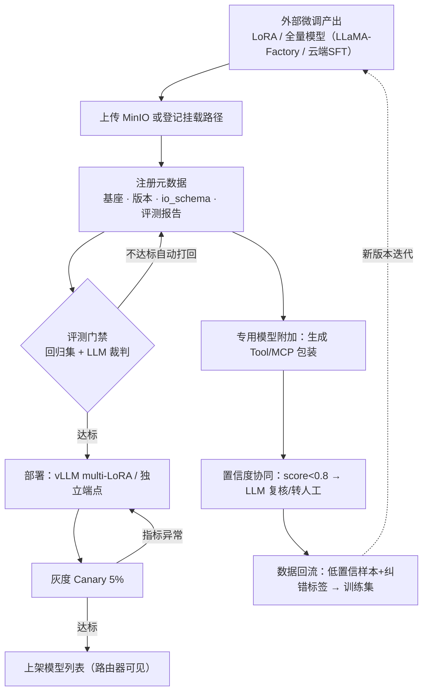
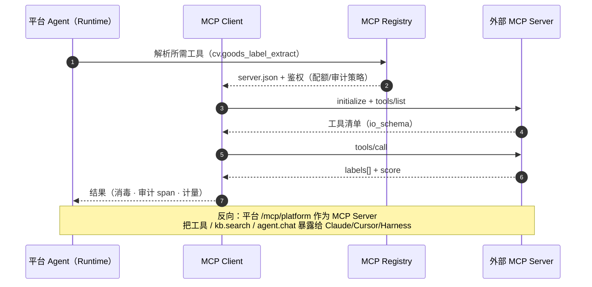
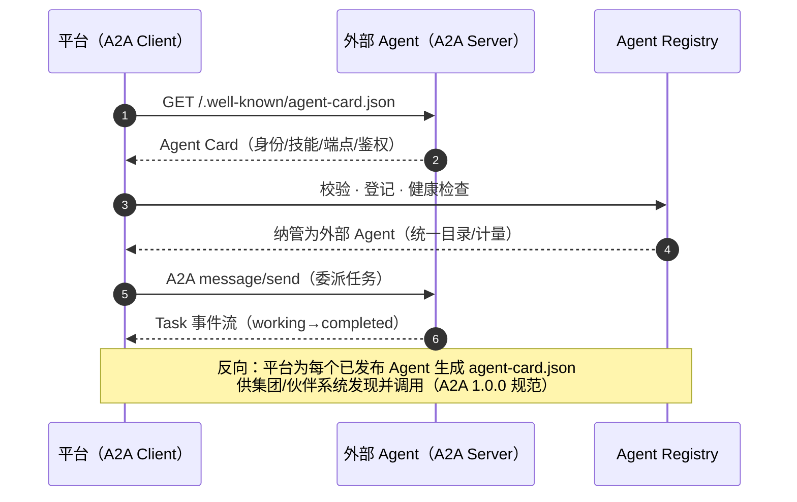
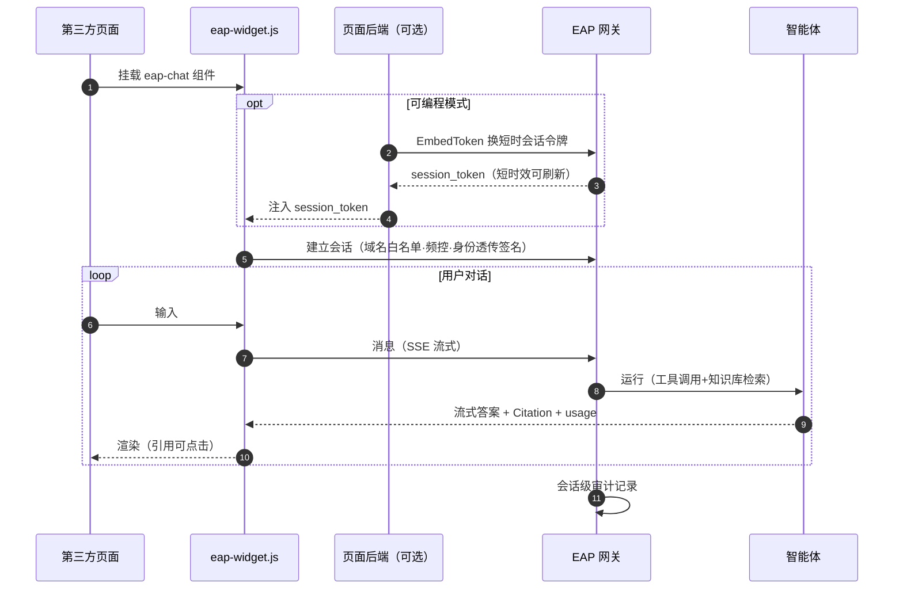

# 04 核心机制设计

> EAP 系列文档 04/09 ｜ 上篇：[03 Agent Runtime](03-AgentRuntime与执行模型.md) ｜ 下篇：[05 领域模型](05-领域模型与数据模型.md)

---

## 1. 知识中心（多知识库 + 知识图谱，R2）

### 1.1 多 KB 实例模型

知识库是**一等资源对象**，数量不限、按需新建：

| 概念 | 说明 |
|---|---|
| KB 实例 | 独立的知识库（如 `product-docs`、`finance-policy`、`website-faq`），独立权限、独立统计 |
| KB 模板 | 快速建库：**客服 FAQ 模板**（问答对表格导入、命中即答、可挂官网渠道）、文档库模板、API 文档模板 |
| 绑定关系 | KB 可被多个 Agent 声明引用（manifest.knowledge）；也可绑定到渠道（官网客服 Widget 绑定 `website-faq`） |
| 级联链 | Document → Chunk → Vector / GraphEntity，删除原文级联清理（见 [05 §4](05-领域模型与数据模型.md)） |

### 1.2 Ingestion（多模态摄入）

```
来源：文档上传 / 网页抓取 / API 同步 / 数据库同步 / QA对导入
  ↓
解析：MinerU 或 RAGFlow DeepDoc（版面分析·表格还原·OCR·公式）
  ↑ 专用视觉/抽取模型可被解析管道调用（见 §3.4）
  ↓
分块：父子分块（small-to-big）· 语义分块 · 表格整块 · QA 对直存
  ↓
增强：LLM 生成摘要/假设问题 · 元数据抽取（标题/章节/权限标签）
```

### 1.3 RAG V2 检索管道



- **Vector 擅长**：语义相似、模糊查询、自然语言；**Graph 擅长**：实体关系、多跳、因果、组织/上下游。典型场景："这个客户过去采购过哪些存在质量风险的产品？"——沿 客户→订单→产品→生产企业→原材料→供应商 图谱多跳，再回向量库找风险描述。
- **Citation（企业刚需）**：答案必须携带 `来源文档 + 页码 + Chunk 定位 + KB 版本`，前端可点击原文定位。
- **动态性**：LightRAG 式增量图谱构建（文档级实体关系抽取、增量合并、社区摘要），文档增删改不需全量重建；重建任务走 Task Engine 异步执行。

## 2. 模型中心（R1 + R3）

### 2.1 模型能力抽象

不写死 `model=qwen-max`，而是按**能力**路由：

| capability | 说明 | 典型提供方 |
|---|---|---|
| chat / reasoning | 对话 / 深度推理 | GPT、Claude、Qwen、DeepSeek、本地 vLLM |
| embedding / rerank | 向量化 / 重排 | bge、Qwen-Embed、Cohere Rerank |
| vision | 图像理解 | Qwen-VL、GPT-4o |
| **extraction** | **结构化抽取/标签化/OCR（专用模型主战场）** | 自训 CV/YOLO/UFunSFT 等 |
| stt / tts / image_gen | 语音与图像生成 | Whisper、CosyVoice、SD |
| moderation | 安全审查 | 自研+云审核 |

Agent 按能力声明（`models: [{capability: reasoning}]`），路由器在满足能力的模型中按 **时延/成本/质量/租户/可用性/数据边界** 选择。

### 2.2 统一端点与路由策略

所有模型（外部 API + 本地 vLLM + 专用模型）经模型网关暴露为 OpenAI 兼容端点；降级链、重试、配额、语义缓存内置。策略引擎（Policy Engine）在路由前介入：

```yaml
policies:
  - id: finance-internal-only          # 数据边界策略
    when: { kb: "finance-*", data_class: confidential }
    route: { allow: ["local.vllm.*"], external: deny }
  - id: simple-task-cost-tier          # 成本分级
    when: { task_tier: simple }
    route: { prefer: qwen-turbo, fallback: [deepseek-chat], max_cost_per_1k_tokens: 0.02 }
  - id: region-pin
    when: { tenant_region: cn }
    route: { prefer: ["qwen*", "deepseek*"] }
```

学术依据：RouteLLM（ICLR 2025）证明路由器可在保持 95% GPT-4 水平下节省约 2x 成本；平台以规则策略为基础，预留 RouteLLM 式学习型路由器作为演进位。

### 2.3 定制模型注册（微调模型上架，非训练平台）



> 图源：[diagrams/06-custom-model-registration.mmd](../diagrams/06-custom-model-registration.mmd)

```
外部微调产出（LLaMA-Factory/云端SFT 的 LoRA 或全量模型）
  ↓ 上传 MinIO 或登记挂载路径
注册表单：基座模型·版本·上下文长度·评测报告·io_schema
  ↓
自动评测门禁（评测中心跑回归集 + LLM 裁判，指标不达标自动打回）
  ↓
vLLM multi-LoRA 加载或独立 Deployment（K8s）
  ↓
灰度（Canary 5% 流量）→ 上架模型列表 → 路由器可见、可被 Agent 声明引用
```

### 2.4 专用模型（图片识别/标签提取）的更优接法【方案 A】

针对"大模型做图像识别/标签化总出问题，自训预训练模型打成服务给大模型调"的现状，升级为四层机制：

1. **注册为模型中心一等公民**：与 LLM 同表管理（`kind: SpecializedModel`），声明 `capability: extraction` + endpoint + io_schema，RAG 解析管道（OCR/表格）与智能体都能按能力调用；
2. **一键"模型即工具"**：注册时按 io_schema 自动生成 Tool + MCP 包装（如 `cv.goods_label_extract`），智能体以标准工具身份调用，天然获得鉴权、计量、限流、审计；
3. **置信度协同编排**：专用模型返回 `score` → 路由策略 `score<0.8 自动转 LLM 复核或转人工`；反向模式同样支持（LLM 抽取→专用模型校验）。替代"大模型裸调"的不可控；
4. **数据回流闭环**：低置信样本 + 人工纠错标签自动归集为训练数据集（数据飞轮），新版本模型经评测门禁→灰度→上架，全程版本可回滚。

```yaml
apiVersion: model.eap.io/v1
kind: SpecializedModel
metadata: { name: goods-label-extractor, version: 1.3.0 }
spec:
  capability: extraction
  endpoint: http://cv-svc.cv.svc:8501/v1/extract
  io_schema: { input: image+regions, output: labels[], confidence: score }
  tool_wrap: { enabled: true, tool_name: cv.goods_label_extract }
  fallback: { to: qwen-vl-max, when: "score < 0.8" }
  data_flywheel: { capture: low_confidence, dataset: goods-label-v2 }
```

## 3. 技能中心（Skill Registry，R6）

参照 Anthropic Agent Skills 开放标准：技能 = 文件夹（`SKILL.md` 主文件 + scripts + references + assets），**三级渐进式披露**控制上下文消耗（L1 只载名称与描述 → L2 载 SKILL.md 正文 → L3 按需载引用资源）。

```yaml
# SKILL.md frontmatter 示例
name: excel-report
description: 从数据生成格式化 Excel 周报（含图表与透视）
version: 2.1.0
permissions:
  filesystem: { read: ["~/Documents/**"], write: ["~/Documents/Reports/**"] }
  network: { allow: ["api.company.com"] }
  tools: { allow: [excel.read, excel.write] }
signature: eap-sig:sha256:...      # 平台签名，防篡改
```

治理链：上传 → 静态扫描（依赖/权限/代码审计）→ 评测（技能回归集）→ 审核 → 签名 → 上架**技能市场** → 租户/员工订阅 → Agent manifest 引用 或 Harness 本地安装。技能在云端与 Harness 使用同一格式与签名体系。

## 4. 工具与连接器中心（Tool ≠ Connector）

| 概念 | 定义 | 示例 |
|---|---|---|
| **Tool** | Agent 能做什么（能力单元） | `create_order`、`query_inventory` |
| **Connector** | 连到哪个系统（通道单元） | SAP 连接器、用友连接器、飞书连接器、SQL 连接器 |

一个 Tool 绑定一个 Connector 执行。Connector 类型：ERP / CRM / OA / HR / Email / 飞书 / 钉钉 / 企业微信 / SQL（PG/MySQL）/ REST / S3 / 浏览器。工具注册三种来源：OpenAPI 导入、函数注册（SDK）、**MCP Server 导入**。

## 5. MCP 全栈（R8）与 A2A 1.0

平台的三重 MCP 身份：



> 图源：[diagrams/09-mcp-tool-call.mmd](../diagrams/09-mcp-tool-call.mmd)

| 身份 | 场景 |
|---|---|
| **MCP Client** | Agent Runtime 调用外部 MCP Server 的工具（含第三方市场服务） |
| **MCP Server** | 平台把工具、知识库检索、乃至"对话式调用某 Agent"暴露为 MCP 端点 → Claude/Cursor/Harness 直接使用 |
| **MCP Registry** | 工具中心纳管内外部 MCP Server（server.json 元数据、鉴权、配额、审计、版本） |

规范基线：MCP 2025-06-18（Streamable HTTP、OAuth、结构化输出），跟踪 2026-07-28 RC（无状态内核 + Extensions）。

**A2A 1.0（对外暴露与外部接入）**：



> 图源：[diagrams/10-a2a-discovery.mmd](../diagrams/10-a2a-discovery.mmd)

- 平台对每个可发布 Agent 生成 **Agent Card**（`/.well-known/agent-card.json`：身份、能力、技能、端点、鉴权），支持 A2A Task 生命周期（含流式与异步任务）；
- 反向：登记外部 Agent 的 Card URL → 自动拉取校验 → 纳入 Agent Registry → 平台内 Agent 可 Handoff 给外部 Agent。
- **边界口诀：MCP = Agent ↔ 工具/数据；A2A = Agent ↔ Agent。**

## 6. 嵌入外链（把智能体挂到任何地方，R4）



> 图源：[diagrams/05-embedded-agent-sequence.mmd](../diagrams/05-embedded-agent-sequence.mmd)

```html
<!-- 第三方页面（官网/门户/任意系统）三行接入 -->
<script src="https://eap.company.cn/sdk/eap-widget.js"></script>
<eap-chat agent="website-faq-agent" endpoint="https://eap.company.cn"
          theme="light" user-id="optional-visitor-id"></eap-chat>
```

安全机制：域名白名单（manifest.embeddable.domains）→ EmbedToken 换取短时会话令牌（绑定 agent/租户/过期/透传用户身份签名）→ SSE 流式 → 频控与防爬 → 会话级审计。同一机制覆盖：官网客服（绑 `website-faq` KB）、企业内门户、以及**外部客户系统**（发放租户级 EmbedToken）。

## 7. 本地 Harness（全面客户端，R5）

> 图源：[diagrams/11-harness-topology.mmd](../diagrams/11-harness-topology.mmd)

```
Harness（Tauri 壳 + Python sidecar）
├─ 本地 Agent Runtime（轻量 Agent Loop，可离线跑本地小模型）
├─ 订阅同步客户端：云端智能体目录 / 知识库（本地缓存+检索）/ 技能包 / 策略
├─ 技能运行时：安装云端市场的签名技能包（权限提示→安装→本地执行）
├─ 本地工具：文件系统 · Office 自动化（Word/Excel/PPT）· 浏览器自动化 · 系统操作
├─ Permission Manager + 沙箱（四域策略）│ 审计日志本地留存+上报
└─ 插件市场入口：浏览/安装/更新技能包与本地插件
```

### 沙箱（Python sidecar 是高权限环境，必须收权）

```yaml
# 技能 "excel-report" 在 Harness 的实际权限（运行时强制）
允许: ✓ D:/Documents/** 读写   ✓ Excel COM   ✓ python(白名单库)
禁止: ✗ 注册表   ✗ SSH/任意网络   ✗ 系统命令   ✗ 读取目录外文件
```

四域策略：**文件系统**（路径 glob 白名单）、**网络**（域名白名单，默认拒绝）、**进程**（可执行白名单）、**浏览器**（站点白名单 + 操作录屏审计）。敏感操作（删除文件、对外发送）触发 HITL 确认弹窗。

## 8. LangChain / LangGraph 手写 Agent 接入（R7，方案 B）

详见 [07 §5](07-API-SDK-Protocol规范.md) 的完整接口签名。要点：**手写代码保持标准 LangChain 语法不变**，平台能力以适配器注入——模型走 OpenAI 兼容网关、知识库返回标准 Retriever、动态技能经 MCP 适配器启动时拉取、LangGraph 图对象经 `@register_agent` 装饰器适配为 AgentApp。不使用 SDK 的团队可走 MCP/A2A 直连，不被锁定。
