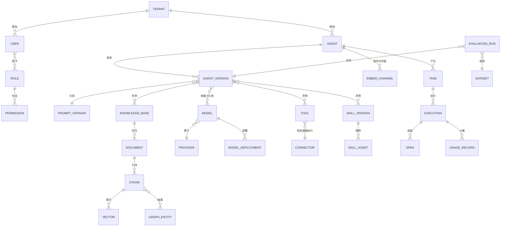

# 05 领域模型与数据模型

> EAP 系列文档 05/09 ｜ 上篇：[04 核心机制设计](04-核心机制设计.md) ｜ 下篇：[06 安全与治理](06-安全与治理架构.md)

---

## 1. 领域模型（ER）



## 2. 核心表结构（关键表）

> 命名前缀省略；所有业务表携带 `tenant_id` 并启用 PostgreSQL **行级安全（RLS）**；软删统一 `deleted_at`。

| 表 | 关键字段 | 说明 |
|---|---|---|
| `tenant` | id, name, plan, region, data_boundary | 数据边界（cn/global）参与路由策略 |
| `user` / `role` / `permission` | …, auth_source(OIDC/local) | RBAC 基础 |
| `agent` | id, tenant_id, name, current_version, status | status ∈ 目录状态 |
| `agent_version` | id, agent_id, version, manifest(jsonb), artifacts_snapshot(jsonb), status | **artifacts_snapshot 冻结引用的 Prompt/Model/Skill/Tool/KB 版本** |
| `agent_instance` | id, agent_version_id, runtime_status, health, registered_by, last_heartbeat | 运行态（Registry 视图） |
| `embed_channel` | id, agent_id, domains[], embed_token_hash, status | 嵌入外链渠道 |
| `kb` / `document` / `chunk` | kb: template, embedding_model, version；chunk: content, meta(jsonb), parent_chunk_id | 父子分块 |
| `vector_collection` 映射 | kb_id → Milvus collection（按租户+KB 切分） | 物理隔离见 06 §3 |
| `model` | id, name, capability[], provider_id, io_schema, context_len, status | LLM 与专用模型同表 |
| `specialized_model_ext` | model_id, confidence_field, fallback_policy, tool_wrap, flywheel_dataset | 专用模型扩展 |
| `model_deployment` | id, model_id, kind(vllm-lora/vllm-full/external), endpoint, replica, canary_weight | 部署与灰度权重 |
| `provider` | id, name, base_url, auth_ref(密钥加密外置), quota | 供应商 |
| `prompt` / `prompt_version` | template, variables[], ab_experiment_id | Prompt 独立资产 |
| `skill` / `skill_version` / `skill_asset` | frontmatter(jsonb), signature, review_status | 技能包 |
| `tool` / `connector` | tool: schema(jsonb), source(openapi/function/mcp)；connector: kind, credential_ref | Tool/Connector 分离 |
| `mcp_server` | id, url, server_json(jsonb), auth, status | MCP Registry |
| `task` / `execution` | task: state, priority, schedule, retry_policy；execution: checkpoint_ref | 长任务 |
| `span` / `usage_record` | span: trace_id, parent, kind, tokens, latency；usage: model, tokens_in/out, cost | 观测与计费事实表 |
| `dataset` / `evaluation_run` | dataset: cases(jsonb)；run: scores(jsonb), gate_result | 评测中心 |
| `release_pipeline` | artifact_type, artifact_id, env, stage, evidence | 版本/环境/门禁 |

## 3. 组合版本（Composite Versioning）

一个可运行 Agent = 六类制品版本的**冻结组合**：

```
Agent v1.4.0
 ├── Prompt      v12
 ├── Model       reasoning→qwen2.5-72b-ft(v3) @ vLLM deploy #18
 ├── Skill       sales-analysis v2.1 · excel-report v1.9
 ├── Tool        erp.order.create v1.2 · erp.inventory.query v1.0
 ├── Knowledge   product-docs @ snapshot 2026-09-01T08:00
 └── Workflow    （若为工作流 Agent）dsl v7
```

规则：**运行时永远引用版本号，不引用活配置**；知识库"版本"为摄入快照（增量摄入产生新 snapshot，回滚即切回）。这直接回答"这个 Agent 为什么线上和测试不一样"——差异可 diff 到具体制品版本。

## 4. 数据生命周期（Data Lifecycle）

```
Ingestion → Version(快照) → Index(三路索引) → Active → Archive → Delete(逻辑) → Purge(物理)
```

级联清理矩阵（删除一篇文档时）：

| 对象 | 动作 |
|---|---|
| Chunk / Vector | 删除（Milvus 按 chunk_id 批量删） |
| GraphEntity / 关系 | 仅删除由该文档抽取的实体与边（LightRAG 式增量回退），无他源引用则连点删除 |
| 语义缓存 | 按 KB 失效 |
| 会话引用（Citation） | 保留指针并标记"原文已删除"（审计需要，不删历史答案） |
| MinIO 原文件 | 进入 30 天回收站后物理清除 |
| 使用记录/账单 | 保留（合规要求，脱敏关联） |

备份与恢复：PG 流复制 + 每日快照；Milvus/Neo4j 定期快照至 MinIO；RTO ≤ 4h / RPO ≤ 15min（Production 档，见 [08 §5](08-观测评测成本与SLO.md)）。

## 5. 多租户数据隔离落位

| 层 | 隔离手段 |
|---|---|
| API 层 | 租户识别于网关，请求上下文强制携带 tenant_id |
| 关系库 | RLS 策略 `tenant_id = current_setting('app.tenant_id')` |
| 向量库 | 每租户独立 collection（命名 `t{tid}_{kb}`），Milvus partition 二级分 |
| 图库 | 节点/边强制 label 前缀 `t{tid}_`，查询强制注入 |
| 对象存储 | Bucket 内 `tenant/{tid}/` 前缀 + IAM 策略 |
| 缓存/队列 | key/channel 前缀 `t{tid}:` |
| 日志/Trace | span 属性携带 tenant_id，跨租户查询需管理员权限 |

详见 [06 §3](06-安全与治理架构.md)。
