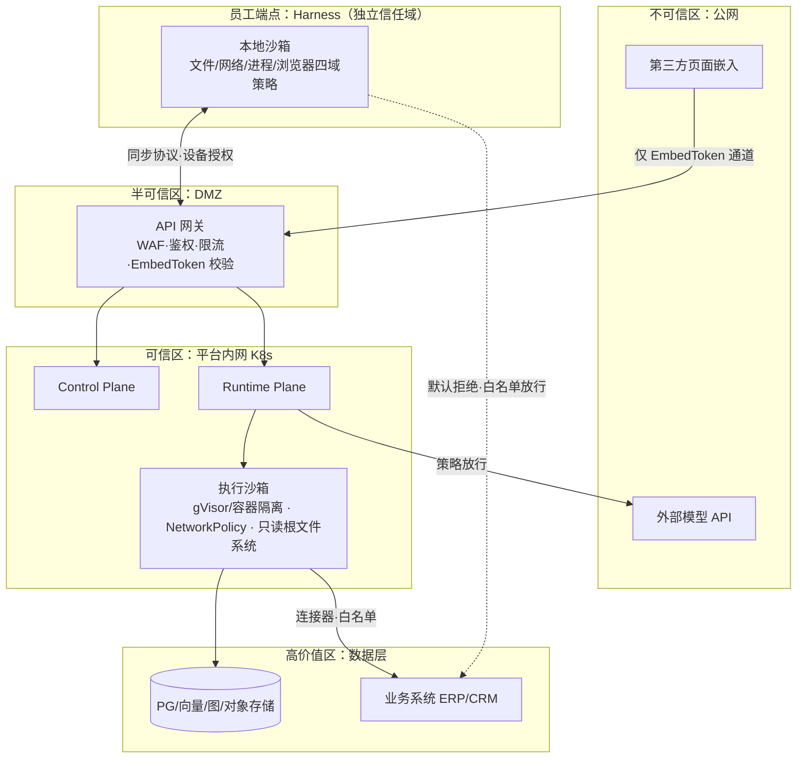
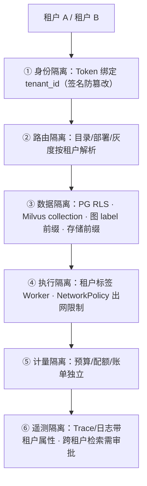
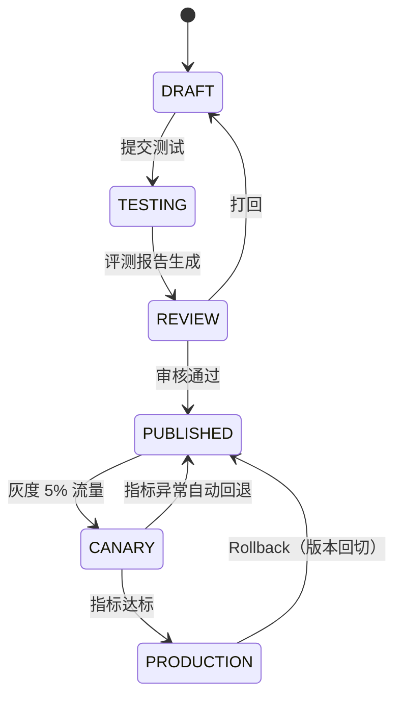

# 06 安全与治理架构

> EAP 系列文档 06/09 ｜ 上篇：[05 领域模型](05-领域模型与数据模型.md) ｜ 下篇：[07 API/SDK/Protocol 规范](07-API-SDK-Protocol规范.md)

---

## 1. 安全六域总览

EAP 的攻击面显著大于普通应用（Harness 有本地高权限、MCP 引入外部工具、外链暴露到公网），安全必须按域设防：

| 域 | 威胁 | 控制点 |
|---|---|---|
| **认证 Authentication** | 凭证泄露、越权接入 | OAuth2/OIDC/SSO（企业 IdP）、Agent API Key（服务间）、Embed Token（外链专用、短时效）、Service Account（Harness 设备授权）、密钥统一加密外置（KMS） |
| **授权 Authorization** | 横向/纵向越权、工具滥用 | RBAC（角色）+ ABAC（数据分级/部门属性）+ 资源 ACL + **工具级权限**（manifest 声明、运行时逐调用校验） |
| **数据安全** | 数据出域、PII 泄露 | 租户隔离（05 §5）、数据分级标签（public/internal/confidential）、PII 检测与脱敏、传输/存储加密、**数据边界路由**（策略中心禁止敏感 KB 流向外部模型） |
| **Agent 安全** | 提示注入、工具注入、SSRF、过度代理、数据外渗 | 输入护栏（注入检测）、工具结果消毒（外部内容当数据不当指令）、出网域名白名单、Tool 最小权限、每轮预算熔断（防失控循环）、输出护栏（敏感信息外渗检测） |
| **执行安全** | 恶意技能/插件、任意代码执行 | 技能签名校验、静态扫描、沙箱（云端容器隔离 / Harness 四域策略）、命令白名单、网络策略（K8s NetworkPolicy + egress 网关） |
| **治理 Governance** | 责任不清、违规不可溯 | 敏感操作审批（HITL）、全量审计日志（谁·何时·用哪个 Agent·调了什么工具·看了什么数据）、策略版本化、合规导出 |

## 2. 信任边界与安全边界图

要点：外链流量与内部流量走不同凭证通道；外部模型 API 属不可信区，敏感数据路由被策略中心阻断；Harness 是**独立信任域**——云端对它只有"订阅与审计"关系，从不直接下发可执行的高权限指令。

## 3. 多租户隔离模型

> 图源：[diagrams/13-multi-tenant-isolation.mmd](../diagrams/13-multi-tenant-isolation.mmd)

隔离层级从上到下逐层收口（每层独立成立，任一层失守仍有下一层兜底）：

1. **身份隔离**：租户感知网关，Token 绑定 tenant_id 且签名防篡改；
2. **路由隔离**：按租户解析 Agent 目录与部署（canary 按租户灰度）；
3. **数据隔离**：RLS / collection / label / 前缀（矩阵见 [05 §5](05-领域模型与数据模型.md)）；
4. **执行隔离**：Agent 执行在带租户标签的 Worker/容器中，K8s NetworkPolicy 按租户限制出网；
5. **计量隔离**：token/成本按租户独立账户，预算熔断互不影响；
6. **遥测隔离**：Trace/日志带租户属性，跨租户检索需平台管理员权限并留痕。

## 4. 版本、发布与环境治理

- **环境体系**：`dev → test → staging → prod`，全部制品（Agent/Prompt/Skill/Model/KB 配置/工具）支持环境晋升；staging 与 prod 同构（数据脱敏）；
- **发布门禁**：评测中心报告（准确率/grounding/工具成功率/安全/时延/成本阈值）是 REVIEW→PUBLISHED 的硬条件，详见 [08 §3](08-观测评测成本与SLO.md)；
- **灰度**：按流量比例、租户名单、用户名单三种维度；异常指标（错误率、护栏触发率、时延）自动回退；
- **回滚**：Agent 版本回切秒级（引用切换），模型部署回滚经 Deployment 权重调整；
- **审计证据链**：每次发布留存 manifest diff + 评测报告 + 审批人，可追溯"谁在何时改了什么"。

## 5. Harness 端点安全（重点专项）

1. **设备信任**：首装设备授权码 + 企业 SSO 绑定；设备指纹与证书入册，可远程吊销；
2. **技能包安全**：仅可安装平台签名技能包；安装前展示权限清单（文件/网络/进程/浏览器）经员工确认；运行时由 Permission Manager 逐调用强制；
3. **本地数据边界**：知识库本地缓存加密（DPAPI/Keychain）；企业策略可禁止敏感 KB 下发到端；
4. **遥测与应急**：本地审计日志防篡改留存并定期上报；平台可远程禁用某技能包/某设备；离线时降级为本地技能 + 本地缓存知识库，恢复后补传审计。

## 6. 审计与合规

- 审计事件模型：`who(actor) / when / where(tenant, channel) / what(agent_version, tool, kb, model) / result`；
- 三类必审：工具执行（尤其写操作）、知识库访问（confidential 级）、管理与发布操作；
- 保留策略：审计 ≥ 3 年（可配），会话内容按租户策略（默认 180 天）；
- 合规支撑：等保/数据出境评估所需的导出报表（按租户/按时间段/按数据级）。
