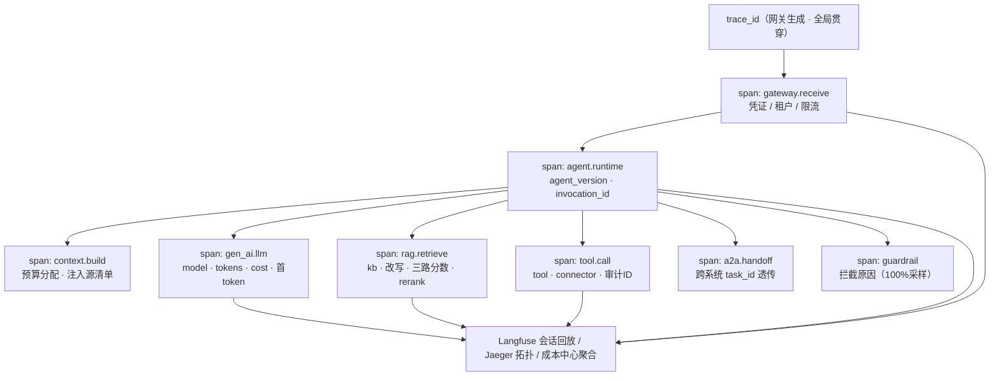

# 08 观测、评测、成本与 SLO

> EAP 系列文档 08/09 ｜ 上篇：[07 API/SDK/Protocol](07-API-SDK-Protocol规范.md) ｜ 下篇：[09 技术选型与路线](09-技术选型与实施路线.md)

---

## 1. 链路追踪（R9-1）



> 图源：[diagrams/16-observability-trace.mmd](../diagrams/16-observability-trace.mmd)

**标准**：OpenTelemetry + GenAI 语义约定（gen_ai.* attributes），自托管 **Langfuse** 做会话级呈现，Jaeger/Tempo 做服务级拓扑。

**Span 模型**（一次嵌入外链调用）：

```
trace: gateway.receive (embed token 校验, 租户解析)
  └─ agent.runtime (agent_version, invocation_id)
       ├─ context.build (budget 分配, 注入了哪些源)
       ├─ gen_ai.llm (model, tokens_in/out, cost, latency)     ← 每轮循环各一个
       ├─ rag.retrieve (kb, 改写, 三路召回分数, rerank 结果)
       ├─ tool.call (tool, connector, 参数摘要, 结果摘要, 审计ID)
       ├─ skill.invoke (skill_version, 步骤)
       └─ a2a.handoff (外部 agent, task_id)                    ← 跨系统延续同一 trace
```

- **贯穿规则**：trace_id 从网关生成，经 SDK 注入到模型/工具/检索调用，跨 A2A 边界经 Task 透传；嵌入外链场景以 `session_id` 关联多轮；
- **采样**：错误与护栏拦截 100%，正常流量头部采样（可配 1–10%）；
- **Harness**：本地执行产生 span 批量加密上报，离线暂存；
- **呈现**：控制台"会话回放"= Trace 树 + 每步上下文快照 + 引用 + 成本，排障直达"哪一步、哪个工具、哪个版本"。

## 2. 服务监控（R9-2）

**标准**：Prometheus 指标 + Grafana 看板 + Alertmanager 告警。

| 域 | 核心指标 |
|---|---|
| 网关 | QPS、P95/P99 时延、错误率、各凭证类型拒绝数、限流触发 |
| Runtime | 并发 Agent 数、队列深度、任务状态分布、Checkpoint 延迟、HITL 等待时长 |
| 模型 | 每供应商/每能力 RPM·TPM、首 token 时延、降级/熔断次数、vLLM GPU 利用率/KV cache 占用 |
| 知识 | 摄入吞吐、索引滞后、检索 P95、rerank 命中率 |
| 成本 | 每租户/Agent token 消耗速率、预算余额 |
| Harness | 在线设备数、技能安装量、沙箱拦截数、本地错误率 |

告警分三级（P1 电话/IM 强提醒：核心链路不可用、数据边界策略失配；P2：错误率/队列积压/SLO 燃烧率；P3：容量与趋势），全部规则版本化于 Git。

## 3. 评测中心（Evaluation Center）

```
Dataset（测试集：标准问答 + badcase 回归 + 越狱攻击样例）
   ↓
Evaluation Run：LLM-as-Judge（事实性/相关性）+ 规则裁判（格式/引用/权限）
                + 人工抽检（高价值场景）
   ↓
发布门禁（REVIEW→PUBLISHED 硬条件）
```

门禁阈值示例（按场景可调，存于策略中心）：

| 指标 | 门禁线 |
|---|---|
| 准确率 / Grounding（有据回答率） | ≥ 90% / ≥ 95% |
| 工具调用成功率 | ≥ 98% |
| 安全样例通过率 | ≥ 99% |
| P95 时延 / 单次成本 | ≤ 3s / ≤ 场景预算 |
| 回归 | 相对上一版本不得倒退 >1pt |

在线评测：生产流量抽样对照（影子流量 1%）、用户反馈回流为 badcase 数据集，与数据飞轮（04 §2.4）共用存储。

## 4. 成本中心（Cost Center）

```
计量采集（span.usage → usage_record）
  → 定价表（模型单价 / 工具调用价 / GPU 秒价，租户可覆盖）
  → 聚合（租户 → Agent → 用户 / 模型 / KB）
  → 预算与配额（月度预算、阈值告警 80%/95%、超限动作：降级模型或拒绝）
  → 账单与报表（对账导出）
```

示例视图：`销售 Agent 本月 ¥3,280（GPT ¥2,100 / Qwen ¥680 / 本地 vLLM ¥80 / 工具 ¥420）`。成本数据同时反哺路由策略（自动向低成本满足质量的模型倾斜）。

## 5. SLO 与容量规划

| 指标 | MVP | Production |
|---|---|---|
| API P95（非流式） | < 2s | < 500ms |
| Agent 首 token | < 5s | < 3s |
| 可用性 | 99% | 99.9% |
| 并发 Agent 会话 | 50 | 1000+ |
| RAG QPS | 20 | 500 |
| 租户隔离 | 基础（RLS） | 完整（六层，见 06 §3） |
| 故障恢复 | 手工 | 自动（多副本 + 自愈 + 回滚） |
| RTO / RPO | 24h / 24h | 4h / 15min |

容量依据（Production 档，按 1000 并发会话、平均 8K token/轮估算）：vLLM 2×A100-80G 起（7B–72B 量化 + multi-LoRA，按推理压测扩容）；PG 16C64G（读写分离）；Milvus 3 节点（内存 ≈ 向量量级×1.5，1 亿 768 维向量 ≈ 250GB）；Redis 集群 3 分片；日志/Trace 按每日 100GB 估算保留 30 天（对象存储冷归档）。每季度按实测压测修订。
